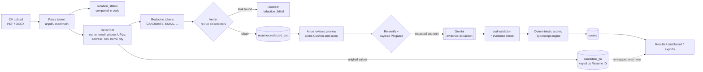

# Kargo Hiring Dashboard

A web app that helps Arjun Mehta (founder, Kargo) screen **Product Manager** and **Senior Product
Manager** CVs against rubrics built from his own past hires. You upload a CV, the app strips personal details, you confirm
what the AI will see, and it returns a deterministic, explainable score with a downloadable breakdown.

> **The system recommends, Arjun decides.** The AI only extracts facts from an anonymised CV. Every level, score,
> gate and band is computed by code from [`rubrics/kargo_rubrics_config.json`](rubrics/kargo_rubrics_config.json).

## What this build does (Components Map)

| Actor | Step | What happens | This build |
|---|---|---|---|
| Founder | Trigger | Uploads a CV and selects the applied role (PM / SPM) | ✅ |
| Founder | Input | CV file + selected role | ✅ PDF / DOCX, ≤ 4 MB, magic-byte checked |
| System | Context | Extracts candidate info and prepares data. **Personal details excluded from the AI** | ✅ deterministic redaction + fail-closed verification + founder confirmation |
| System | Processing | Scores the candidate against the rubric | ✅ **applied role only** (see below) |
| AI (LLM) | AI | Evidence extraction from redacted text | ✅ Gemini, structured JSON, temperature 0 |
| AI (LLM) | AI | Interview brief + personalised email (invite or rejection) | ✅ from redacted inputs; the name is filled in only at send time |
| Email (Resend) | Send | Sends email when founder clicks send | ✅ one-click send with confirm; test mode redirects every email to you |
| Founder | Output | Hiring dashboard: ranked candidates, scores, interview brief, draft emails (one-click send) | ✅ plus CSV / XLSX / JSON exports |

**Scoring scope decision (Arjun, 28 Sep 2026):** a CV is scored **only** against the rubric of the role it was submitted for.
There is no other-role score and no cross-role routing. The reference engine's `evaluate_candidate()` (both roles plus routing)
is still ported and parity-tested, but the app calls `evaluateAppliedRole()`.

## Data flow: where PII is removed



What reaches Gemini: the system prompt and schema from `KARGO_RUBRICS.md` §3, the rubric `roles` block, the Resume ID, the
applied role, and the **redacted** CV text. Nothing else. Some Gemini tiers may use prompts to improve Google's products,
which is one more reason redaction happens first and is verified twice (at upload and again just before the call).

## Pages

| Page | What it's for |
|---|---|
| **Candidates** (`/candidates`, home) | Every evaluated CV ranked per role: score, recommendation, level chips for all 8 rubric criteria, flags, and **Accept / Reject / Details** actions |
| **Interviews** (`/interviews`) | Everyone who has been sent an interview invitation, with their full interview brief and the slots offered |
| **Upload CVs** (`/upload`) | Choose the role and drop up to 60 PDF/DOCX. Each CV is evaluated **automatically**: the name is read from the CV, personal details are removed and verified, the redacted text is scored, and the batch lands on the dashboard |
| **Details** (`/results/[id]`) | Why ranked here, per-criterion breakdown with evidence, eligibility, probes, brief, email editor, downloads |
| **Examples** (`/examples`) | The two worked samples through the real pipeline |

## After scoring: brief, email, send

The `email_policy` in the rubric config decides what gets drafted:

| Final band (after capacity caps) | Brief | Email draft |
|---|---|---|
| Accept – Priority | ✅ | Interview invite with 3 slots within 5 working days (IST, Mon–Fri) |
| Accept | ✅ | Interview invite with 3 slots within 7 working days |
| Review – Arjun decides | after Arjun clicks **Invite** | nothing until Arjun clicks **Invite** or **Reject** |
| Reject | – | Warm, role-specific rejection |

Arjun can override any recommendation with **Invite** / **Reject** on the result page. Nothing is ever sent without his click.

- **Brief** (`lib/ai/brief.ts`): summary, strengths with *verbatim* evidence (checked against the CV text), risks to test, and 4–6 interview questions built from the rubric probes. Logistics lines (relocation, level fit) come from code.
- **Email** (`lib/ai/email.ts`): the model gets redacted highlights and the slots, never the name. Drafts are stored as templates with `[CANDIDATE_FIRST_NAME]`, and the real first name and address are merged in only at send time. Rejections pass a wording guard: no scores, criteria names, rubric, penalties, "DNA", ranking or AI mentions. A violating draft is retried once, then replaced by a safe template.
- **Send** (`lib/email/resend.ts`): one Resend call with an idempotency key, guarded by a `draft → sending → sent` transition so a double click can't send twice.
  - `EMAIL_MODE=redirect` (default): every email goes to `EMAIL_REDIRECT_TO`, subject prefixed `[TEST]`, with a banner showing the real recipient. With Resend's `onboarding@resend.dev` sender, that must be the email of your Resend account.
  - `EMAIL_MODE=live`: sends to candidates. Requires `RESEND_FROM` on a domain verified in Resend.

## Setup

Requires Node 20+ (tested on Node 24). Python 3 is only needed for the parity script.

```bash
npm install
cp .env.example .env.local        # then fill in the values
npm run dev                       # http://localhost:3000
```

### Environment variables

| Variable | Where used | Notes |
|---|---|---|
| `GEMINI_API_KEY` | server only | Google AI Studio key |
| `GEMINI_MODEL` | server only | default `gemini-3.8-flash` (verified against the models list on 28 Sep 2026) |
| `STORAGE_DRIVER` | server only | `local` (dev: JSON file in `.data/`), `neon` or `supabase` |
| `DATABASE_URL` | server only | Neon connection string (Neon dashboard → Connect) |
| `RESEND_API_KEY` | server only | Resend API key |
| `RESEND_FROM` | server only | default `Kargo Hiring <onboarding@resend.dev>`; live mode needs a verified domain |
| `EMAIL_MODE` | server only | `redirect` (default, test) or `live` |
| `EMAIL_REDIRECT_TO` | server only | where test-mode emails go |
| `SUPABASE_URL` | server only | |
| `SUPABASE_SERVICE_ROLE_KEY` | server only | never sent to the browser |
| `SUPABASE_ANON_KEY` | RLS test only | used by `tests/rls-check.ts` to prove the anon key is denied |

### Neon (recommended database)

1. Create a project in Neon and copy the connection string into `DATABASE_URL` in `.env.local`.
2. Run `npm run db:neon`. It applies [`db/neon/0001_init.sql`](db/neon/0001_init.sql) (all tables, with original CV files in a `bytea` table since Neon has no file storage), verifies each table, and does a write/read round trip.
3. Set `STORAGE_DRIVER=neon`. Access is only through the server-side connection string; nothing is exposed to the browser.

### Supabase (alternative)

1. Run [`supabase/migrations/0001_init.sql`](supabase/migrations/0001_init.sql) and [`0002_brief_email.sql`](supabase/migrations/0002_brief_email.sql) in the Supabase SQL editor (or `supabase db push`).
   It creates the five tables, enables **RLS with no policies** on each (only the service role can access them), and creates
   the **private** `cv-originals` bucket.
2. Set `STORAGE_DRIVER=supabase` plus the three Supabase variables.
3. Verify: `npx tsx --env-file=.env.local tests/rls-check.ts`. It checks that the service role can read and write, the anon key is
   denied on every table, and the bucket is private.

## Tests

```bash
npm test               # vitest unit tests (engine parity, PII, parsing, AI payload, store, exports)
npm run parity         # Python reference vs TypeScript port on fixtures + 500 randomised extractions
npm run test:e2e       # real Gemini: both samples, asserts decisions and PII-free payloads
npx tsx --conditions=react-server --env-file=.env.local tests/e2e/followup.ts   # real Gemini brief + email drafts; sends nothing
npm run secret-scan    # also runs automatically as a git pre-commit hook (.githooks/)
```

Results at the time of writing: **148 unit tests passing** (including brief/email policy, the rejection guard, and send with a mocked Resend). Parity: **8,476 / 8,476 checks identical** with 2,000 random
extractions (default runs use 500). **E2E 12 / 12**. See [`samples/expected_outputs.md`](samples/expected_outputs.md).

## How the scoring works

Full rules: [`rubrics/KARGO_RUBRICS.md`](rubrics/KARGO_RUBRICS.md). In short:

1. Gemini returns sub-signal **facts**, verbatim evidence snippets and evidence grades (A/B/C). It never outputs a level or score.
2. Code checks that every snippet actually appears in the redacted text (substring, or `difflib` ratio ≥ 0.85). If not, the level is set to 0 and an `evidence_not_found:<id>` flag is raised.
3. Code derives levels 0–3 for 8 criteria; points = weight × level/3 × evidence multiplier.
4. Penalties (cap −12) and bonuses (cap +5) are applied, then the score is clamped to 0–100.
5. Gates, non-negotiables, the DNA triad and floors decide the band. On the dashboard, capacity caps (3 Priority, 6 Accept-or-better per role) are applied at read time.

| Band | Decision label |
|---|---|
| `priority_shortlist` | **Accept – Priority** |
| `shortlist` | **Accept** |
| `review` | **Review – Arjun decides** |
| `not_shortlisted` | **Reject** |

**Tuning the rubric:** the config JSON is the *only* place to change weights, rules, caps or bands. Bump its `version`
when you do. Stored extractions can be re-scored without a new AI call (`rescoreFromStored()` in `lib/pipeline.ts`). A few
thresholds appear in the config only as prose (gate years, the 0.9 DNA multiplier, level-rule months and counts). They live in
`RULE_THRESHOLDS` in `lib/scoring/config.ts`, and a drift test fails if the config text and the constants disagree.

## Worked examples

Two fictional CVs, runnable from **Examples** in the app:

| Sample | Applied | Actual score | Actual decision |
|---|---|---|---|
| `sample_accept_pm.docx` (ops → sole PM at a Series A freight SaaS) | PM | **100.0** (3/3 runs) | **Accept – Priority** |
| `sample_reject_pm.docx` (1 of 9 PMs at a consumer fintech, credential-led) | PM | **0.0** (3/3 runs) | **Reject** |

Details, redacted previews and per-criterion levels: [`samples/expected_outputs.md`](samples/expected_outputs.md).

## Deployment (Vercel)

1. Supabase must be set up first: the local JSON store does not persist on serverless, and the app refuses to start it on Vercel.
2. Import the GitHub repo in Vercel (framework: Next.js) or run `npx vercel link`.
3. Add every variable above to **Production** and **Preview**, with `STORAGE_DRIVER=supabase`.
4. Deploy, then smoke-test: login, both examples through the pipeline, and the downloads.

API routes run on the Node.js runtime; `/api/score/*` has `maxDuration = 60` (a Gemini call takes about 10–20 s, plus one retry).

## Security and privacy

- PII lives only in `candidate_pii` (and the private original file). Every other table, log line, audit payload and the Gemini request uses the Resume ID only. The stored file name is reduced to `cv.pdf` / `cv.docx`, because file names often contain the candidate's name.
- Redaction fails closed: if any detector still fires after redaction, the resume is marked `redaction_failed` and scoring is blocked. A second guard (`assertNoPii`) refuses to send any request containing a stored contact value or identifier.
- Excluded attributes (name, gender, age, photo, marital status, religion, caste, college name, family background, home city, career gaps) have no path into scoring. They are either redacted or not represented in the schema, and the prompt tells the model to ignore them.
- **No login** (removed at Arjun's request). Anyone who can reach the URL can see candidates and trigger drafting/sending. Keep the deployment private (Vercel Deployment Protection) or add auth back before sharing the URL.
- CSV exports prefix cells starting with `= + - @` with `'`, so spreadsheets can't evaluate them as formulas (phone numbers start with `+`).

## Limitations

- The rubric pattern comes from **8 past hires** (5 thriving). It is a strong hypothesis, not proof. There is no senior PM among them; the SPM archetype is borrowed from the Head of Engineering.
- **Scanned PDFs are not supported** (no OCR). Upload a DOCX or a text-based PDF.
- **Name detection is automatic** (a `Name:` label, the header lines while skipping job titles, or the email local part cross-checked against the CV). If no credible name is found, or any personal detail survives redaction, the CV is **held back and never sent to the AI**; it's flagged on the upload page with a "Fix & score" link. Name tokens under 3 characters are only removed as part of the full name.
- Gemini at temperature 0 is not perfectly deterministic. Borderline sub-signals can change a level between runs (see the samples). Decisions for the two samples were stable across 3 runs.
- Home-city detection covers a list of Indian and major international cities on the contact line and on `Location:` lines. Unusual places may need manual review in the preview.

## Next phase

- Bulk upload
- Calendar integration for interview slots (slots are proposed in code today)
- Resend webhooks for delivery / bounce status
- Optional: re-enable cross-role scoring and routing if Arjun wants it (already implemented and tested in the engine)

## Repository layout

```
app/                 pages (login, upload, review, results, candidates, examples) and API routes
lib/scoring/         TypeScript port of the reference engine (config, levels, evaluate, rank, explain)
lib/pii/             detectors, redaction, verification, location status
lib/ai/              Gemini client, prompt (generated from KARGO_RUBRICS.md §3), zod schema
lib/db/              store interface, local JSON / Neon / Supabase drivers
lib/followup.ts      brief + email drafting per email_policy, Arjun's decision, one-click send
lib/email/           Resend client (test/live modes), interview slot proposals
lib/export/          CSV / XLSX builders
rubrics/             KARGO_RUBRICS.md, kargo_rubrics_config.json (source of truth)
reference/           Python reference engine + tests (parity checks)
samples/             sample CVs (.docx + source), expected_outputs.md
db/neon/             0001_init.sql (full Neon schema)
supabase/migrations/ 0001_init.sql, 0002_brief_email.sql
tests/               unit tests, E2E, RLS check
proxy.ts             auth guard (Next 16's name for middleware)
```
